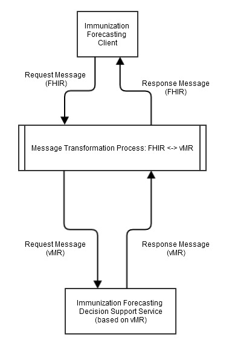

# Clinical+Quality+Framework+Pilots     

Pilot :

- [Cardiology Appropriateness of Use](http://wiki.siframework.org/Cardiology+Appropriateness+of+Use)

- [Chlamydia Screening](http://wiki.siframework.org/Chlamydia+Screening)

- [Immunization Decision Support Services](http://wiki.siframework.org/Immunization+Decision+Support+Services)

- [Ischemic Vascular Disease: Use of Aspirin or Another Antithrombotic](http://wiki.siframework.org/Ischemic+Heart+Disease+and+Anti-Platelet+Use)

- [Radiology Appropriateness of Use](http://wiki.siframework.org/Radiology+Appropriateness+of+Use)

- [Venous Thromboembolism Prophylaxis](http://wiki.siframework.org/Venous+Thromboembolism+%28VTE%29+Prophylaxis)

  
**Ischemic Vascular Disease (IVD):**      
Use of Aspirin or Another Antithrombotic
Motive’s primary goal is to support the development of a national standard for sharable, executable CDS artifacts
and quality measures. This community effort and experience is critical to achieving outcomes-driven health care
and providing clinicians with the tools they need to deliver high-quality care.

In this pilot, Motive will demonstrate that a shareable ECA rule can be created, deployed, and executed in at least
one third-party clinical system, such as an electronic health record (EHR), or by a cloud-based CDS service, using
the CQF standard for artifact representation.
This pilot will support the implementation and testing of the CQF data model (QUICK) and query language (CQL) in
a real-world scenario and provide feedback and specifications for the standards documentation and implementation guide.              

**Radiology Appropriateness of Use**:     
The goal of the pilot is to provide ordering physicians Point of Order access to Appropriate Use Criteria for Imaging orders. Appropriate Use Criteria provides feedback as to the appropriateness score for an imaging order. Each imaging order is assigned a unique decision support identifier and appropriateness score and users are presented feedback in the form a score and suggested alternate exams. This decision support data is recorded within the EHR. This data and activity is also recorded in the CDS service for Quality Measurement.
The appropriateness score, structured reason for exam and associated imaging order can be used to track impact of AUC on care, identify overall ordering patterns and be incorporated into Clinical Quality Measures. The Pilot will also demonstrate how this data can be used in such a report and example eCQM.
The pilot will also demonstrate how the data generated (appropriateness score, physician behavior etc) during a service-based evaluation can be incorporated into Clinical Quality Measures through generation of reports from both the EHR and cloud based service. In the case of an EHR, appropriateness data will be incorporated into an example CQM calculation and physician activity reports. In the case of a cloud based service, the pilot will demonstrate how data from multiple health care providers accessing the service can be aggregated, in effect demonstrating a registry.
During the pilot, user interaction within CPOE during an imaging order, selection of exam and structured indication and other data elements (eg Service Requestor), will generate a query to a cloud based DSS containing National Standard Appropriate Use Criteria published by the American College of Radiology. The pilot will demonstrate how an existing integration model deployed in the market can be adapted to the CQF. The pilot scope will include an existing EHR vendor. 

**Chlamydia Screening**:              
The goal of this pilot is to demonstrate the usability of the new specifications (Quality Improvement and Clinical Knowledge or QUICK data model, Clinical Quality Language or CQL), where the standards need improvement, and to provide experiential input on how the specifications will serve future implementations in Electronic Health Record systems. This pilot will be focused on how QUICK and CQL can be successfully tailored to suit the needs of implementers interested in supporting clinical decision support (CDS) and clinical quality measures (CQM) for screening, treatment, and follow-up of chlamydia trachomatis infection in community settings.
Additional benefits of the pilot include:

- Broader visibility into the harmonized standards being developed in HL7
- Ability to leverage initiative resources
- Contribution to unification of the CDS/CQM community
- Recognition as an early adopter

At the conclusion of the pilot, pilot participants will aid an evaluation that will inform further development of the specifications.             

**Immunization Decision Support Services**:        
The pilot team intends to demonstrate in a live Immunization Calculation Engine (ICE) instance that a FHIR profile aligned with QUICK, can successfully be processed by ICE. Demonstrating that a dataset used by a typical immunization forecaster can be properly supported by the CQF standards helps ensure that CQF standards could be leveraged by other immunization forecasters. In addition, adopters may find ICE more in line with other CDS engines that they are consuming are operating.
The Data Flow Diagram below depicts the interaction we intend to demonstrate. By building a “man in the middle” message transformation, we aim to demonstrate that an existing immunization forecasting system based on vMR can be migrated to QUICK.

The following link contains the pilot summary. Please contact daryl@hln.com with questions.

https://docs.google.com/document/d/1EJaDehSJqvvtaDTtEsa2jcYEVuZEEylQ7nV0N40sf80/edit?usp=sharing
